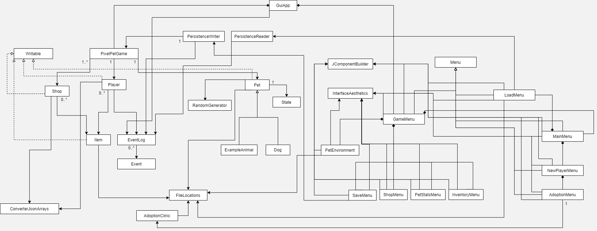

# CPSC 210 PROJECT <br><span style="font-size:24px">Virtual Pixel-Pet</span>

## 📖 Table of Contents
<ul style="font-size:18px;list-style-type:circle">
    <li><a href="#project-overview">Project Overview</a></li>
    <li><a href="#user-stories">User Stories</a></li>
    <li><a href="#phase-4-task-2">Phase 4: Task 2</a></li>
    <li><a href="#phase-4-task-3">Phase 4: Task 3</a></li>
    <li><a href="#credits">Credits</a></li>
</ul>

[//]: # (    <li><a href="#known-issues">Known Issues</a></li>)

## Project Overview

As the name of this project suggests, this is an *interactive* application game where   
you are tasked to take care of a **virtual pet** of *your* choosing. It is a simplified desktop    
version of the popular toy in the late 1990's and early 2000's; the **Tamagotchi**.

The intended user audiences for this application are *children and teens*, however,   
the game itself is suitable for people of all ages as it makes for a pleasant pastime.  
As someone who dreams of having a little companion and is passionate about game     
development, this project is the ideal. In addition, it will allow me to explore the    
vastness of **OOP** in both a **structural** and **creative** manner.

## User Stories

<p style="font-size:16px;">"As a user, I want to be able to..."</p>
<ul style="font-size:16px;list-style-type:'► ';margin-top:-10px;">
    <li>"...choose the type of animal and the breed of my pet"</li>
    <li>"...buy items at a shop and store them in my inventory"</li>
    <li>"...give treats/toys/food to my pet from my inventory"</li>
    <li>"...learn about my pet's health, personalities, likes and dislikes"</li>
    <li>"...access different menus such as the store or my inventory"</li>
    <li>"...create a save point for my player, pet, and the shop's state"</li>
    <li>"...load my player, pet, and the shop's data from the previous save point"</li>

[//]: # (    <li>"...earn in-game money"</li>)
</ul>

## Phase 4: Task 2

<p style="font-size:18px;">Sample Logging:</p>

```
Tue Mar 29 18:14:34 PDT 2022
Loaded game session ID 1647816369.

Tue Mar 29 18:14:39 PDT 2022
Bought Bone (x1) from Kira Kira Pets.

Tue Mar 29 18:14:39 PDT 2022
Added Bone (x1) to inventory.

Tue Mar 29 18:14:44 PDT 2022
Gave Bone (x1) to ExampleAnimal.

Tue Mar 29 18:14:44 PDT 2022
Removed Bone (x1) from inventory.

Tue Mar 29 18:14:46 PDT 2022
Saved game session ID 1647816369.
```

## Phase 4: Task 3

<p style="font-size:18px;">UML Class Diagram:</p>


<p style="font-size:18px;">Refactoring Reflections:</p>
There are still many things I would still like to do with this project. To name a few, I would like to have done further
refactoring to my UI menus, particularly in:
<ul style="margin-top:0;">
    <li>cleaning up the SaveMenu, ShopMenu, PetStatsMenu, and InventoryMenu <br>
so that there is better integration within the GameMenu</li>
    <li>centralizing the LoadMenu and SaveMenu in a PersistenceMenu</li>
    <li>adding an abstract method in Menu class for generating/creating JComponents</li>
</ul>

[//]: # (## Known Issues)

[//]: # ()
[//]: # (<p style="font-size:18px;">Display:</p>)

[//]: # (<ul style="font-size:16px;list-style-type:'❗';margin-top:-10px;">)

[//]: # (    <li>Problem with properly displaying UI on MacOS; possible compatibility issues with fonts</li>)

[//]: # (</ul>)

## Credits

<p style="font-size:18px;">Art Assets:</p>
<ul style="font-size:16px;list-style-type:'► ';margin-top:-10px;">
    <li>Game Cat Icon (by Daniel Moreno): <br>
https://www.pinterest.ca/pin/344032859020619279/</li>
    <li>Environment Room Art (by pixeled--pink): <br>
https://www.deviantart.com/pixeled--pink/art/Isometric-Pixel-Room-Mint-Studio-829957249</li>
    <li>Pixel Retro Game Font (by Daymarius): <br>
https://www.dafont.com/retro-gaming.font</li>
</ul>

<p style="font-size:18px;">Code:</p>
<ul style="font-size:16px;list-style-type:'► ';margin-top:-10px;">
    <li>EventLog and Event Class + Tests (UBC CPSC210): <br>
https://github.students.cs.ubc.ca/CPSC210/AlarmSystem.git</li>
</ul>